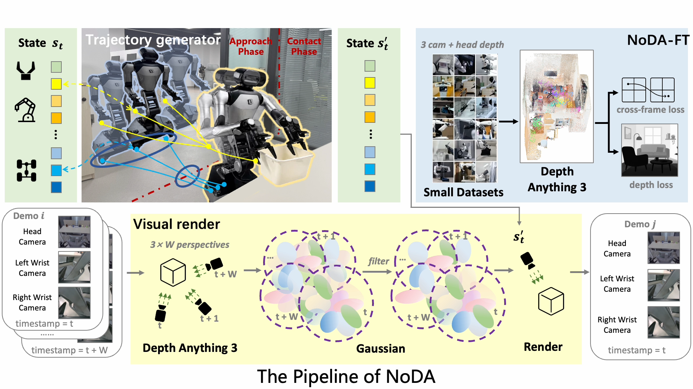

# NoDA: Scaling Mobile Manipulation via Plug-and-Play Novel Demonstration Augmentation

### 🌐 [Project Page](https://nodacorl.github.io/NoDA/)

NoDA is a **calibration-free demonstration-augmentation pipeline** for mobile
manipulation. From one multi-camera clip and its proprioceptive trajectory it emits
new demonstrations seen from perturbed base viewpoints, while holding the manipulated
object's world trajectory fixed. It uses only the source RGB and proprioception — no
per-setup calibration, scene scan, or URDF.

It has two components:

- a **trajectory generator** (`trajectory_augment.py`) that perturbs the source base
  trajectory to new viewpoints; and
- a **visual renderer** that re-renders the cameras at those viewpoints by
  reconstructing, with a fine-tuned
  [Depth Anything 3](https://github.com/ByteDance-Seed/Depth-Anything-3) backbone
  (**NoDA-FT**), a **per-frame 3D Gaussian Splat sequence** in a single global, metric
  frame — each frame independent, a static per-frame model. Its two
  conceptual stages are split across three scripts: Stage 1 produces the per-frame
  splat — pose estimation (`stage1_pose.py`) then Gaussian initialization
  (`stage1_gaussians.py`) — and Stage 2 is photometric refinement (`stage2_refine.py`).



## Directory layout

```
open_source/
├── trajectory_augment.py   # Trajectory generator: base-perturbed demonstrations
├── stage1_pose.py          # Renderer Stage 1: globally-aligned per-frame camera poses
├── stage1_gaussians.py     # Renderer Stage 1: per-frame Gaussian Splat initialization
├── stage2_refine.py        # Renderer Stage 2: per-frame photometric refinement
├── utils/
│   ├── geometry.py         # w2c↔center, similarity transforms, Umeyama, window stitching
│   ├── gaussians.py        # Gaussian transforms + differentiable gsplat renderer (GSParams)
│   ├── se_math.py          # SE(2)/SE(3) poses, embedding, split interpolation
│   └── io_utils.py         # frame loading, windowing, frame-spec parsing
└── README.md
```

## Requirements

- `depth_anything_3` (the DA3 package shipped under `../src`; scripts add it to
  `sys.path` automatically)
- `torch`, `numpy`, `scipy`, `opencv-python`, `pillow`
- `gsplat` (Stage 2 rendering only)

## Input data format

The three rigidly-mounted cameras of the rig — one head-mounted (`head`) and two
wrist-mounted (`left_wrist`, `right_wrist`) — one PNG per camera per frame:

```
{frames_base}/{camera}/{frame:06d}.png
```

Within a `W`-frame window these three cameras act as `3 × W` views of the scene,
giving a wider baseline than the three cameras provide at any single instant.

The trajectory generator instead reads the demonstration's proprioceptive
trajectory as a single npz:

```
base_se2  (H, 3)     # mobile-base pose per frame: x, y, yaw
eef_se3   (H, 4, 4)  # end-effector world pose per frame
gripper   (H,)       # gripper opening per frame
```

## Quick start

```bash
# Trajectory generator — N base-perturbed trajectories per source demo
python trajectory_augment.py \
    --source /data/clip/ep000/trajectory.npz --num-aug 4 \
    --r 0.12 --phi-deg 10 --epsilon 0.1 --out /data/out/trajectory

# Stage 1 — globally-aligned metric poses (NoDA-FT, sliding windows)
python stage1_pose.py \
    --frames-base /data/clip/ep000 --cameras head,left_wrist,right_wrist \
    --frame-start 66 --frame-end 116 --finetuned-ckpt noda_ft.pt \
    --out /data/out/stage1

# Stage 1 (cont.) — per-frame Gaussian init (NoDA-FT GS head)
python stage1_gaussians.py \
    --frames-base /data/clip/ep000 --stage1 /data/out/stage1 \
    --finetuned-ckpt noda_ft.pt --frames 66-115 --out /data/out/gaussians

# Stage 2 — photometric refinement (gsplat)
python stage2_refine.py \
    --stage1 /data/out/stage1 --init-from /data/out/gaussians \
    --gt-base /data/clip/ep000 --frames 66-115 --out /data/out/refine
```

The trajectory generator is independent of the renderer. Within the renderer, each
stage reads the previous one's output from disk, so the stages run independently and
resume cleanly (Stage 2 supports `--skip-existing`).

## Outputs

| Script | File | Contents |
|---|---|---|
| `trajectory_augment` | `augmented_{i:02d}.npz` | `aug_base` `(H,3)`, `aug_eef` `(H,4,4)`, `aug_eef_in_base`, `dpert_base`/`dpert_eef` (body-local perturbations for Eq. 6), `action_base_se2`, `action_eef_se3`, `t_star` |
| `stage1_pose` | `stage1_global_poses.npz` | `cameras`, `frame_indices`, `extrinsics_global` `(n_cam, n_frame, 4, 4)` w2c, `cam_centers_global` `(n_cam, n_frame, 3)` |
| `stage1_gaussians` | `per_frame_gaussians/frame_{:06d}.npz` | `means`, `scales`, `rotations` (wxyz), `opacities`, `harmonics_dc`, `camera_idx`, plus the frame's global extrinsics; `intrinsics_{cam}.npy` dumped once |
| `stage2_refine` | `per_frame_gaussians/frame_{:06d}.npz` | refined Gaussians (same schema) + per-camera final L1 |
